# HorseStore: Low-Level EVM Implementation Study

> **Solidity → Yul → Huff** — Demonstrating bytecode-level optimization and EVM internals mastery through identical contract implementations.

[](https://soliditylang.org/)
[](https://huff.sh/)
[](https://getfoundry.sh/)
[](.)

---

## Why This Exists

Same contract logic implemented at three abstraction levels:

- **Solidity** — High-level baseline
- **Yul** — Inline assembly optimization  
- **Huff** — Raw opcodes (738-line ERC721)

Useful for understanding how Solidity compiles to bytecode, identifying gas optimization opportunities, and recognizing patterns during security audits.

---

## Technical Highlights

| Metric | Solidity | Yul | Huff |
|--------|----------|-----|------|
| **V1 Runtime** | ~165 bytes | ~140 bytes | ~90 bytes |
| **V1 Deploy** | ~250 bytes | ~200 bytes | ~100 bytes |
| **Gas (write)** | Baseline | -12% | -25% |
| **Abstraction** | High | Medium | None |

### What's Implemented

**V1 — Minimal Storage Contract**
- `updateHorseNumber(uint256)` / `readNumberOfHorses()`
- Function dispatcher patterns
- Storage slot management

**V2 — Full ERC721 NFT (738 lines of Huff)**
- Complete ERC721Enumerable implementation
- Custom game mechanics (`feedHorse`, `isHappyHorse`)
- 24+ function selectors with manual dispatcher
- `safeTransferFrom` with `onERC721Received` callback handling
- Storage mapping calculations via keccak256


## Architecture

### Compilation Pipeline


### V2 Contract Architecture

```mermaid
flowchart TB
    subgraph Entry["Transaction Entry"]
        CALLDATA["calldata"]
    end

    subgraph Dispatcher["Function Dispatcher (MAIN macro)"]
        SELECTOR["Extract selector calldataload(0) >> 0xe0"]
        JUMPTABLE["Jump Table 24+ selectors"]
    end

    subgraph HorseLogic["HorseStore Logic"]
        MINT["mintHorse() _safeMint(caller, totalSupply++)"]
        FEED["feedHorse(id) timestamp → mapping"]
        HAPPY["isHappyHorse(id) check 24hr window"]
    end

    subgraph ERC721["ERC721 Core"]
        TRANSFER["transferFrom"]
        SAFE["safeTransferFrom + onERC721Received"]
        APPROVE["approve / setApprovalForAll"]
        QUERY["balanceOf / ownerOf"]
    end

    subgraph Storage["Storage Layout"]
        S0[("0: totalSupply")]
        S1[("1: ownerOf[id]")]
        S2[("2: fedTimestamp[id]")]
        S3[("3: balanceOf[addr]")]
        S4[("4: approvals")]
    end

    CALLDATA --> SELECTOR
    SELECTOR --> JUMPTABLE
    JUMPTABLE --> HorseLogic
    JUMPTABLE --> ERC721
    
    MINT --> S0 & S1 & S3
    FEED --> S2
    HAPPY --> S2
    TRANSFER --> S1 & S3 & S4
```



### Huff Function Dispatcher (Low-Level)


---

## Implementation Deep-Dive

### Storage Slot Calculation (Mappings in Huff)

Solidity mappings use `keccak256(key . slot)` for storage location. In Huff, this is implemented manually:

```plaintext
#define macro horseIdToFedTimeStamp_Macro() = takes(0) returns(0) {
    0x04 calldataload              // [horseId]
    [Horse_Store_Location]         // [slot, horseId]
    0x20 mstore                    // [horseId] (slot at mem[0x20])
    0x00 mstore                    // [] (horseId at mem[0x00])
    0x40 0x00 sha3                 // [keccak256(horseId . slot)]
    sload                          // [fedTimestamp]
    0x00 mstore
    0x20 0x00 return
}
```

### ERC721 Safe Transfer Pattern


---

## Security Analysis

### Identified Issues

| Severity | Issue | Location | Status |
|----------|-------|----------|--------|
| 🔴 **Medium** | Feeding non-existent horses | `feedHorse()` | Documented |
| 🟡 **Low** | Unlimited public minting | `mintHorse()` | By Design |
| 🟢 **Info** | No tokenURI implementation | `tokenURI()` | Returns empty |

### Feed Function Vulnerability

```solidity
// Missing existence check allows feeding unminted horses
function feedHorse(uint256 horseId) external {
    horseIdToFedTimeStamp[horseId] = block.timestamp;
    // ❌ No: require(_exists(horseId), "NOT_MINTED");
}
```

**Impact**: Storage pollution, misleading `isHappyHorse()` returns for non-existent IDs.

### Security Invariants Maintained

1. `ownerOf(id) != address(0)` ⟹ token exists
2. `balanceOf` sum equals minted count
3. Approvals cleared on transfer
4. CEI pattern in all transfers (reentrancy safe)

---

## Quick Start

### Prerequisites

```bash
curl -L https://foundry.paradigm.xyz | bash && foundryup
curl -L https://huff.sh | bash && huffup
```

### Build & Test

```bash
git clone https://github.com/a1111198/Huff-Yul-HorseStore-NFT.git
cd Huff-Yul-HorseStore-NFT
forge install
forge build
forge test -vvv
```

### Gas Report

```bash
forge test --gas-report
```

---

## Project Structure

```
src/
├── HorseStoreV1/
│   ├── horseStore.sol       # Solidity baseline
│   ├── yulHorseStore.sol    # Yul optimization
│   └── horseStore.huff      # Huff implementation
└── HorseStoreV2/
    ├── horseStore.sol       # Full ERC721 (Solidity)
    ├── HorseStore.huff      # Full ERC721 (Huff) - 738 lines
    └── IhorseStore.sol      # Interface

breakdown/
└── Solc-OpCodes.c++         # Annotated bytecode analysis

test/
├── v1/                      # V1 test suite
└── v2/                      # V2 test suite (shared base)
```

---

## Tech Stack

| Component | Technology |
|-----------|------------|
| Smart Contracts | Solidity 0.8.20, Yul, Huff |
| Testing | Foundry (Forge) |
| Huff Libraries | huffmate (ERC721, CommonErrors) |
| Reference | OpenZeppelin Contracts |
| EVM Target | Cancun |

---

## Related Work

This project complements my other blockchain security research:

- **[Formal Verification with Halmos/Certora](https://github.com/a1111198/Formal-verification-and-symbolic-Execution)** — Symbolic execution for math functions

---

## License

GPL-3.0-only

---

## References

- [Huff Language Docs](https://docs.huff.sh/)
- [EVM Opcodes](https://www.evm.codes/)
- [EIP-721 Specification](https://eips.ethereum.org/EIPS/eip-721)
- [Solidity Yul Documentation](https://docs.soliditylang.org/en/latest/yul.html)
